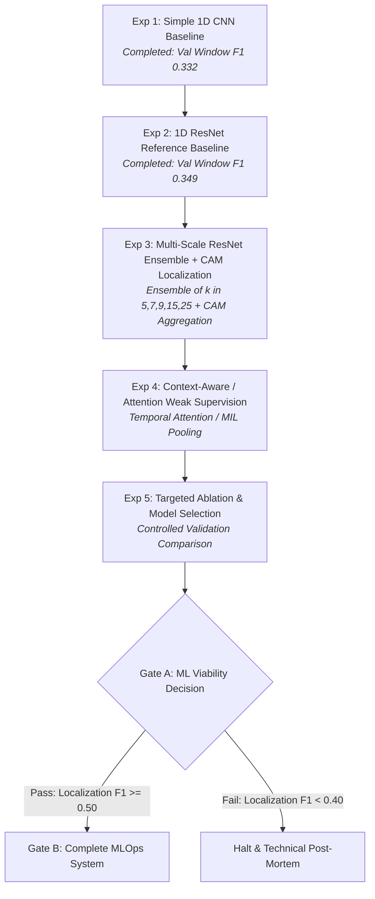
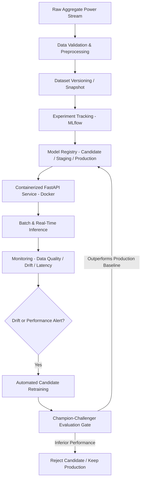

# SmartMeter Appliance Intelligence — Operational Execution Plan

---

## 1. Project Mission

**SmartMeter Appliance Intelligence** is an end-to-end MLOps platform for detecting and temporally localizing specific household appliance activations from aggregate electricity smart-meter consumption.

The system addresses the Non-Intrusive Load Monitoring (NILM) challenge using weak supervision: models are trained using coarse, household-level presence indicators (without requiring expensive sub-meter hardware at training time) to reconstruct precise temporal activation timelines during inference.

The project is structured as a complete MLOps engineering system centered on a validated, defensible deep-learning core.

---

## 2. Final Deliverable

The project delivers an end-to-end operational software and ML system consisting of:

1. **Reproducible Data & Preprocessing Pipeline:** Continuous timebase regularization, contiguous segment windowing, validation-safe strong target generation, and immutable versioned data snapshots.
2. **Weakly Supervised Temporal Localization Model:** An evaluated 1D temporal convolutional architecture that ingests 510-point aggregate power windows (68 minutes @ 8s resolution) and produces point-by-point temporal activation masks.
3. **Experiment Tracking & Model Registry:** Systematic tracking of code revisions, datasets, seeds, hyperparameters, metrics, and registered model artifacts (using MLflow or equivalent).
4. **Production Serving API & Batch Inference:** A containerized FastAPI service providing low-latency inference, explicit model versioning headers, and batch-processing capabilities.
5. **Continuous Monitoring & Drift Detection:** Real-time tracking of data quality, feature/input distribution drift, prediction distribution shifts, and latency monitoring.
6. **Automated Candidate Retraining & Promotion Pipeline:** Triggered retraining on new data, comparative evaluation against the active production baseline, and gated model promotion.
7. **Comprehensive Audit & Reproducibility Suite:** Complete test suite, strict test-set isolation proofs, provenance records, and immutable benchmark reports.

---

## 3. Project Success Definition

The project is successful **only when BOTH quality gates are achieved**:

- **GATE A (Core ML Viability):** A strong, non-degenerate appliance localization model is demonstrated against strong ground-truth validation data.
- **GATE B (MLOps Completeness):** That validated model is fully operationalized through a reproducible, observable, and containerized MLOps lifecycle.

A project with full MLOps infrastructure but an unviable or failed ML model is **NOT** considered successful.

---

## 4. Problem Definition

- **NILM Setting:** Traditional smart meters record only total whole-house active power ($P_{\text{agg}}(t)$). Sub-metering individual appliances ($P_{\text{app}}(t)$) across millions of households is economically and practically infeasible.
- **Weak Supervision Formulation:**
  - **Input ($X$):** Aggregate active power time-series window of length $T = 510$ points (4,072 seconds / ~68 minutes at 8-second sampling).
  - **Weak Training Label ($y \in \{0, 1\}$):** Coarse household-level presence metadata (1 = monitored appliance present in household; 0 = unmonitored proxy).
  - **Inference Goal ($\hat{M}(t) \in [0, 1]$):** Point-by-point binary activation timeline localizing exactly *when* the appliance operated within the aggregate window.
- **Explicit Metric Terminology & Distinction:**
  - **Window Classification F1:** Binary window-level detection classification ($P(\text{appliance active in window}) \ge 0.5$). Used exclusively for baseline sanity diagnostics (CNN and single ResNet).
  - **Localization F1:** Point-level and event-level temporal overlap segmentation metric ($\text{Precision}, \text{Recall}, \text{F1}$ computed across all timestamps). Used exclusively for the final Gate A model viability decision.
  - *These two metrics evaluate completely different tasks and must never be conflated or compared directly.*

---

## 5. Data and Target Definition

### Primary Dataset: REFIT Cleaned
- **Source:** *REFIT: Electrical Load Measurements (Cleaned)*, University of Strathclyde / Zenodo (DOI: [10.5281/zenodo.5063428](https://doi.org/10.5281/zenodo.5063428)).
- **Audited Scope:** 20 households recorded at 8-second intervals (House 14 absent from cleaned release; 119,495,879 rows, 6.47 GB uncompressed).
- **Selected Target Appliance:** **Kettle** (Decision D-005). High power draw (~1500–3000 W), short burst duration, highly distinct signature, available in 14 monitored households.

### Ground-Truth Target Policy (Locked under Decision D-005)
- **Activation Threshold:** $\text{Kettle Power} \ge 1500\text{ W}$.
- **Event Continuity:** Consecutive active samples merged into a single event if the sampling gap is $\le 20\text{ s}$.
- **Duration Filter:** Events $> 600\text{ s}$ (10 minutes) excluded from ground-truth localization as sensor-freeze anomalies.
- **Household-Specific Eligibility & Constraints:**
  - **H12:** Excluded from primary localization evaluation due to corrupt/inconsistent sub-meter data (provides weak label only during training).
  - **H13:** Retained in test set with $> 600\text{ s}$ anomalies filtered out.
  - **H17:** Retained in validation set (contains shared Kettle/toaster channel challenge).
  - **H21:** Retained in train set (shared Kettle/toaster channel and solar aggregate challenge).
  - **H19:** Retained in train set (documented Kettle vs. aggregate discrepancy).
  - **Unmonitored Households (H1, H10, H15, H16, H18):** Weak-negative training proxies ($y=0$), NOT claims of physical absence.

### Timebase & Windowing Policy (Locked under Decision D-006)
- **Regular Grid:** 8.0-second regular timebase.
- **Gap Handling:** Gaps $\le 16\text{ s}$ forward-filled (zero-order hold); gaps $> 16\text{ s}$ terminate the contiguous segment. Never interpolate across segment boundaries.
- **Window Geometry:** 510 points (4,072 seconds / 67.87 minutes). Windows must reside strictly within a single contiguous segment.

---

## 6. Experimental Rules & Invariants

1. **Mandatory Household-Level Split:** Datasets are split strictly by household ID before generating windows. No random window splitting, no segment splitting, and no temporal leakage across splits.
2. **Sealed Test Set:** Households **H2** and **H13** are frozen holdouts. They must never be accessed for training, architecture exploration, hyperparameter tuning, threshold selection, normalization fitting, or early stopping.
3. **Strong Target Separation:** Strong sub-meter measurements and window evaluation targets are strictly evaluation-only. They must never enter training model inputs or training loss functions.
4. **Train-Derived Normalization:** Standardization statistics ($\mu_{\text{train}}, \sigma_{\text{train}}$) are computed exclusively across the 16 TRAIN households. Validation and test data are never seen during normalization fitting.
5. **Traceable Provenance:** Every experiment must record Git commit hash, dataset snapshot SHA256, seed (42), exact configuration YAML, metrics JSON, and model checkpoint paths.
6. **Integrity & Honesty:** Zero fabricated metrics, zero post-hoc threshold searching on test data, zero unrecorded runs.
7. **Simplicity & Explainability:** Every component must be explainable and defensible by an ML engineer in a rigorous technical review.

---

## 7. Current Factual Evidence

### Dataset Index & Split Accounting
- **Total Index Windows:** 174,072 windows across 20 households.
- **Frozen Split Structure (Decision D-007):**
  - **TRAIN (16 households, 141,003 windows / 81.00%):** H1, H3, H5, H6, H7, H8, H9, H10, H11, H12, H15, H16, H18, H19, H20, H21.
  - **VALIDATION (2 households, 18,561 windows / 10.66%):** H4, H17.
  - **TEST (2 households, 14,508 windows / 8.33% — Sealed):** H2, H13.
- **Canonical Snapshot:** `kettle_train_val_snapshot_2026-09-24.zip` (159,564 windows, 18 `.npy` arrays, 18,561 validation target records, SHA256: `dd41f144ceafa516d7b2ba2c0bb42959f7a6e7e7da3cf6a48d96b78da3b8e36a`).

### Completed Baseline Experiments (Window Classification Diagnostics)

| Experiment | Architecture | Training Platform | Best Epoch | Val Window F1 | Val Balanced Acc | Val Behavior |
| :--- | :--- | :--- | :--- | :--- | :--- | :--- |
| **Simple 1D CNN** (D-008) | 2 Conv layers + GAP + Linear | Local CPU (6 epochs) | 1 | 0.3323 | 0.5000 | Near all-positive classification |
| **1D ResNet Reference** (D-009) | 3 ResNet blocks [64, 128, 128] + GAP + Linear | Colab T4 GPU (9 epochs) | 4 | 0.3488 | 0.5399 | Precision 21.36%, Recall 94.97% |

*Note: These baseline figures represent window-level classification diagnostics at threshold 0.5, NOT temporal localization F1.*

---

## 8. Core ML Development Strategy

The ML model progression follows a focused, 5-experiment controlled campaign:

### Controlled Experiment Campaign
1. **Experiment 1 (Completed):** Simple 1D CNN baseline sanity check on weak labels.
2. **Experiment 2 (Completed):** Single 1D ResNet reference baseline on weak labels.
3. **Experiment 3 (Multi-Scale Temporal ResNet Ensemble + CAM-Based Localization):**
   - Reference localization system composed of an ensemble of ResNet models with varying temporal kernel lengths:
     $$\text{ResNet}(k=5),\; \text{ResNet}(k=7),\; \text{ResNet}(k=9),\; \text{ResNet}(k=15),\; \text{ResNet}(k=25)$$
   - Pipeline: Multi-scale ensemble detection $\rightarrow$ Class Activation Map (CAM) extraction $\rightarrow$ CAM normalization/aggregation $\rightarrow$ point-by-point temporal localization mask.
   - Evaluated on validation households H4 and H17 using temporal Localization F1.
4. **Experiment 4 (Context-Aware / Attention Weak Supervision):**
   - One focused model/training-formulation improvement:
     $$\text{Larger Temporal Context} \rightarrow \text{Temporal Feature Extraction} \rightarrow \text{Attention over Internal Regions} \rightarrow \text{Weak Context-Level Prediction} \rightarrow \text{Localization Signal}$$
   - Allows the network to focus on high-energy activation segments within the temporal context rather than uniform global average pooling.
   - Engineering-driven design improvement grounded in time-series weak supervision literature (no novelty claim).
5. **Experiment 5 (Targeted Ablation & Model Freeze):**
   - Targeted ablation isolating the impact of multi-scale ensemble vs. attention pooling vs. localization thresholding.
   - Select and freeze the final candidate model for Gate A evaluation.

---

## 9. ML Viability Gate (Gate A)

The project will proceed to full MLOps infrastructure construction **only if** the core ML model satisfies the Gate A acceptance criteria on the validation split (H4, H17):

### Gate A Acceptance Criteria
- **Primary Metric:** **Validation Localization F1** (point-level / event-level temporal overlap against strong Kettle ground truth).
- **Decision Rules:**
  - **PASS ($\text{Localization F1} \ge 0.50$):** Model demonstrates viable localization. Preferred target: $\approx 0.55 - 0.60$ or higher. Proceed to Gate B (MLOps System).
  - **BORDERLINE ($0.40 \le \text{Localization F1} < 0.50$):** Borderline is **NOT** a pass. Authorizes exactly one targeted diagnostic experiment only if empirical evidence identifies a specific, fixable issue.
  - **FAIL ($\text{Localization F1} < 0.40$):** If the model remains below viable performance after the controlled campaign, **halt and document the technical findings honestly**. Do NOT build MLOps infrastructure around an unviable model.
- **Secondary Requirements:**
  - Balanced Precision and Recall (avoiding trivial all-positive or all-negative collapse).
  - Stable, non-degenerate per-household performance across both validation households (H4 standard, H17 shared toaster challenge).
  - Visual verification that activation maps align with physical Kettle power spikes.

---

## 10. Final Test Protocol

Holdout test households **H2** and **H13** remain sealed until Gate A is passed and all modeling decisions are frozen.

### Release & Test Protocol
1. Freeze final model weights, preprocessing code, and decision threshold $\theta$.
2. Execute a single, automated evaluation pass over test households H2 and H13.
3. Record immutable test metrics (Localization Precision, Recall, F1, Event F1, Confusion Matrix).
4. Strictly forbid any post-hoc hyperparameter, architectural, or threshold tuning based on test results.

---

## 11. MLOps System Architecture (Gate B)

Upon passing Gate A, the complete MLOps operational lifecycle will be implemented using a focused, practical technology stack:

### Focused MLOps Stack & Scope
- **Data Preprocessing & Validation:** Deterministic timebase regularization, missing value checks, and power range validation.
- **Experiment Tracking:** MLflow (or lightweight equivalent) tracking Git commit, dataset snapshot SHA256, hyperparameters, loss curves, and artifact locations.
- **Model Registry:** Managed candidate, staging, and production models with immutable metadata.
- **Serving Engine:** FastAPI application serving batch and point-in-time inference requests with model version response headers.
- **Containerization:** Docker container image packaging the serving application and runtime environment.
- **Continuous Monitoring:** Real-time calculation of input power distribution drift (Wasserstein / PSI), prediction distribution drift, latency profiling (p50/p95), and delayed performance monitoring when labels become available.
- **Gated Retraining & Promotion:**
  - Automated candidate retraining on newly arriving household data.
  - Automated champion-challenger comparative evaluation.
  - **Gated Promotion Policy:** A drift alert alone does not automatically deploy a new model. Production promotion occurs only if the challenger model demonstrates measurable validation metric superiority. Rejection and rollback are fully supported.

---

## 12. MLOps Acceptance Criteria (Gate B)

Gate B is satisfied when all 10 operational capabilities are demonstrated and tested:

1. $\checkmark$ **Tracked Training Run:** Fully logged training execution with Git hash, dataset snapshot SHA256, and loss curves.
2. $\checkmark$ **Model Versioning:** Registered model artifact with explicit semantic versioning in the registry.
3. $\checkmark$ **Reproducible Inference:** Deterministic output recreation from stored model artifact and sample input window.
4. $\checkmark$ **Operational REST API:** FastAPI endpoint accepting aggregate power arrays and returning JSON activation timelines.
5. $\checkmark$ **Inference Latency Profiling:** Measure and report inference latency (at least p50 and p95) on a documented test environment and representative request size.
6. $\checkmark$ **Docker Deployment:** Fully functional container image running the inference API.
7. $\checkmark$ **CI/CD Validation:** Automated test suite running unit tests, data integrity checks, and inference smoke tests on push.
8. $\checkmark$ **Data Quality & Drift Alerting:** Automated detection of simulated sensor faults and consumption distribution drift.
9. $\checkmark$ **Candidate Retraining Workflow:** Scripted pipeline executing retraining on newly integrated household batches.
10. $\checkmark$ **Gated Promotion Decision:** Programmatic champion-challenger evaluation with explicit promotion and rejection handling.

---

## 13. Repository & Reproducibility Operating Model

- **Canonical Repository:** `D:\SmartMeter` (local source tree) synchronized with GitHub (`nayanojwal0810/smartmeter.git`).
- **Remote Synchronization:** GitHub tracks all source code (`src/`), scripts (`scripts/`), configuration (`configs/`), tests (`tests/`), documentation (`docs/`), and lightweight metadata (`artifacts/manifests/*.json`, `artifacts/experiments/*/*.json`).
- **Large Binary Storage:** Processed `.npy` arrays, large `.jsonl` target manifests, and model weight checkpoints (`*.pt`) reside locally and on Google Drive (`MyDrive/smartmeter/`), excluded from Git via `.gitignore`.
- **GPU Execution Platform:** Google Colab operates purely as an ephemeral compute engine. Colab clones the exact Git commit, downloads the verified data snapshot from Drive, executes training, and exports results back to Drive and the canonical repository.

---

## 14. Interview Knowledge & Technical Defense

Every design choice must be technically defensible by an intermediate/final-year ML engineer:

| Domain | Key Concepts & Defense Rationales |
| :--- | :--- |
| **Problem & NILM** | Trade-off between expensive hardware sub-metering vs. algorithmic disaggregation; high-frequency signature vs. low-frequency (8s) power envelopes. |
| **Weak Supervision** | Why household-level metadata acts as Multiple Instance Learning (MIL) bag labels; why weak label $0$ is an unmonitored proxy rather than physical absence. |
| **Temporal Architectures** | Why 1D convolutions with large receptive fields capture appliance duty cycles; residual connections for gradient propagation; multi-scale ResNet kernels for varying duration spikes. |
| **Evaluation Integrity** | Why random window splitting creates catastrophic leakage in NILM; why household-level isolation is mandatory for generalized deployment. |
| **MLOps Lifecycle** | Shift from static notebook models to observable, containerized, versioned production services; handling covariate shift and model degradation over time. |

---

## 15. Portfolio & Resume Positioning

- **Public Project Name:** `SmartMeter Appliance Intelligence`
- **Public Headline:** *An end-to-end MLOps system for weakly supervised appliance detection and temporal localization from household smart-meter data.*
- **Honest Positioning:**
  - Positioned as an MLOps engineering platform with a rigorous, independently implemented ML model core.
  - Research literature cited accurately as technical foundations (not a reproduction or paper clone).
  - All resume performance claims must reflect empirically measured localization F1 from the final frozen test run.

---

## 16. Research Foundation & References

1. **Petralia, A., Boniol, P., Charpentier, P., Palpanas, T. (2025).**
   *Few Labels are All You Need: A Weakly Supervised Framework for Appliance Localization in Smart-Meter Series.*
   IEEE 41st International Conference on Data Engineering (ICDE 2025).
   [arXiv:2506.05895](https://arxiv.org/abs/2506.05895) | [DOI: 10.1109/ICDE65448.2025.00329](https://doi.org/10.1109/ICDE65448.2025.00329)
2. **Murray, D., Stankovic, L., Stankovic, V. (2017).**
   *An electrical load measurements dataset of United Kingdom households from a two-year longitudinal study.*
   Scientific Data, Nature Publishing Group.
   [DOI: 10.1038/sdata.2016.122](https://doi.org/10.1038/sdata.2016.122)
3. **Wang, Z., Yan, W., Oates, T. (2017).**
   *Time Series Classification from Scratch with Deep Neural Networks: A Strong Baseline.*
   IEEE International Joint Conference on Neural Networks (IJCNN 2017).
   [arXiv:1611.06455](https://arxiv.org/abs/1611.06455)
4. **Zhou, B., Khosla, A., Lapedriza, A., Oliva, A., Torralba, A. (2016).**
   *Learning Deep Features for Discriminative Localization.*
   IEEE Conference on Computer Vision and Pattern Recognition (CVPR 2016).
   [arXiv:1512.04150](https://arxiv.org/abs/1512.04150)

---

## 17. Current Status & Immediate Next Actions

### Current Status
- Data forensic audit and Kettle ground-truth target policy locked (Decision D-005).
- Timebase regularization and 510-point windowing policy locked (Decision D-006).
- Primary household split frozen: 16 Train / 2 Val (H4, H17) / 2 Test (H2, H13) (Decision D-007).
- Simple 1D CNN baseline completed (Decision D-008).
- 1D ResNet reference model completed on Google Colab GPU (Best epoch 4, Val window F1 0.3488).
- Sealed data snapshot created and verified (`kettle_train_val_snapshot_2026-09-24.zip`).
- Git source synchronization established on GitHub `main` branch.

### Immediate Next Action
Proceed to **Experiment 3: Multi-Scale Temporal ResNet Ensemble + CAM-Based Localization**:
1. Implement multi-scale ResNet ensemble pipeline ($k \in \{5, 7, 9, 15, 25\}$).
2. Implement Class Activation Mapping (CAM) temporal activation extractor and normalization/aggregation.
3. Implement point-level and event-level temporal localization evaluation metrics.
4. Run validation evaluation on households H4 and H17 against strong Kettle ground truth to measure initial Localization F1.
